# Shannon System Architecture

## Executive Summary

Shannon is a collaborative knowledge management system for academic papers, built as a terminal-based application (TUI) that synchronizes with Git for version control and collaboration. The system transforms dense academic papers into interconnected, searchable notes using Obsidian-compatible markdown files.

### Key Features

- **Paper Import**: Fetch papers from OpenReview with metadata and PDF
- **LLM Extraction**: Automated note generation using local LLMs (GPT-OSS 20B)
- **Full-Text Search**: Tantivy-powered search across all content
- **Git Integration**: Branch-based workflow with automatic commits
- **Obsidian Compatible**: Markdown files work directly in Obsidian

---

## System Context

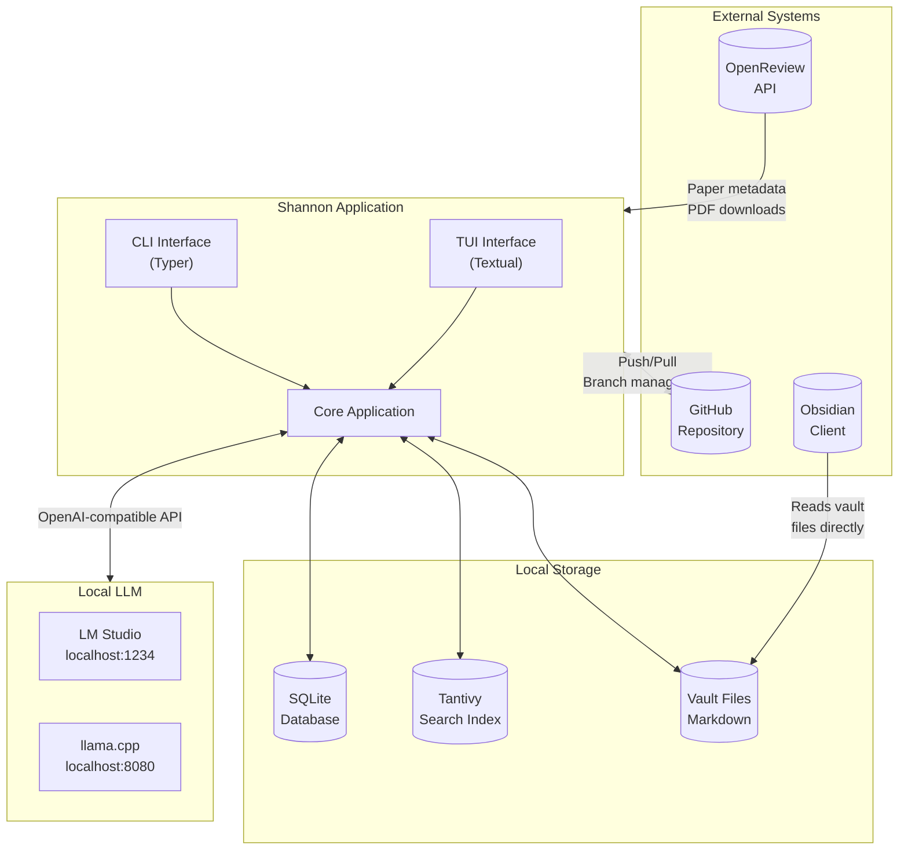

---

## High-Level Architecture

Shannon follows a layered architecture with clear separation of concerns:

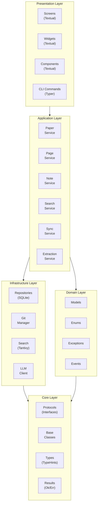

---

## Layer Descriptions

### Core Layer (`src/core/`)

The foundation providing abstractions and contracts for the entire application.

| Component | File | Purpose |
|-----------|------|---------|
| Protocols | `protocols.py` | Interface definitions for dependency injection |
| Base Classes | `base.py` | Abstract implementations with shared logic |
| Types | `types.py` | Type aliases, TypedDicts, NewTypes |
| Results | `results.py` | Result monad (Ok/Err) for error handling |
| Events | `events.py` | Event definitions and EventBus |

> **See also**: [Core Module Summary](core_module_summary.md) for detailed API documentation.

### Domain Layer (`src/domain/`)

Pure business logic and domain models with no external dependencies.

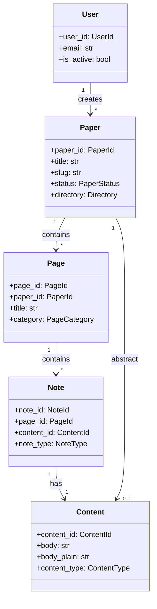

### Infrastructure Layer

External system integrations and data persistence.

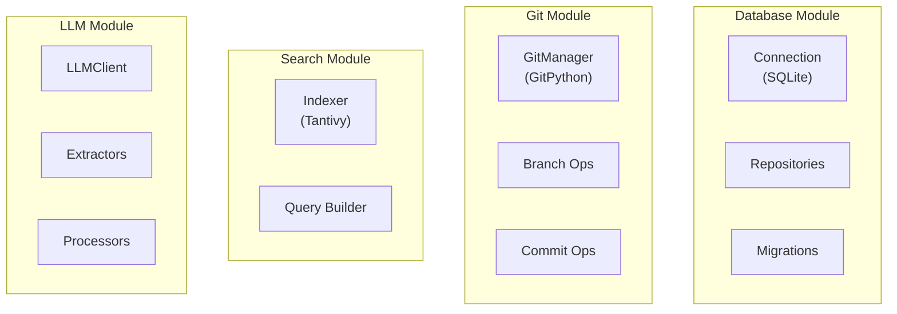

> **See also**: [Database Schema](database_schema.md) for complete table definitions.

### Application Layer (`src/services/`)

Orchestrates domain logic and coordinates between infrastructure components.

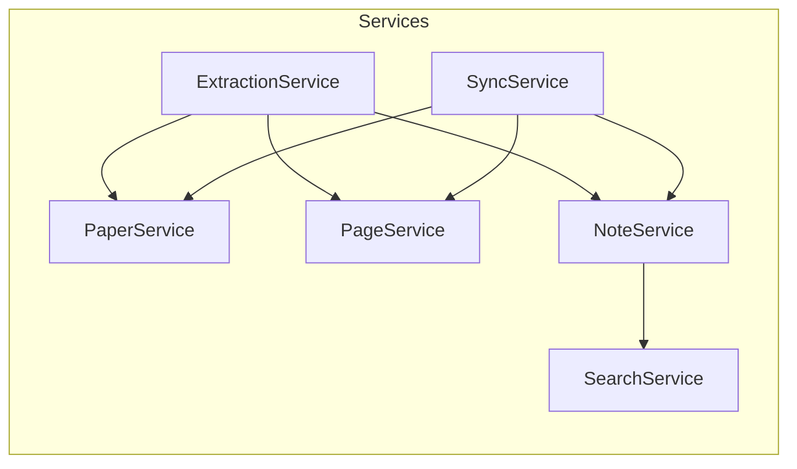

### Presentation Layer (`src/tui/`, `src/cli/`)

User interface components.

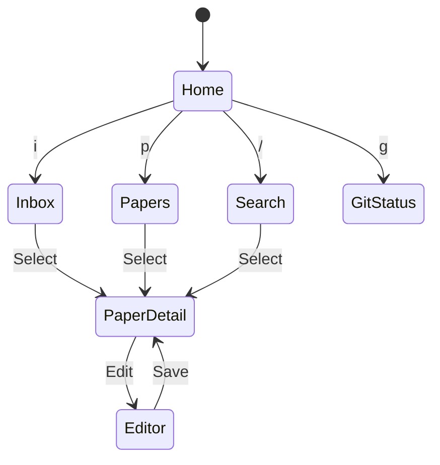

> **See also**: [Directory Summary](directory_summary.md) for complete file structure.

---

## Data Flow Diagrams

### Paper Import Flow

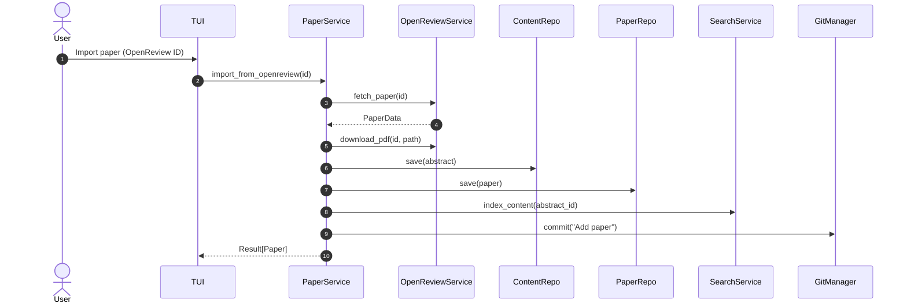

### LLM Extraction Flow

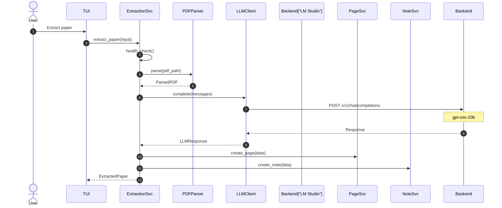

### Git Workflow

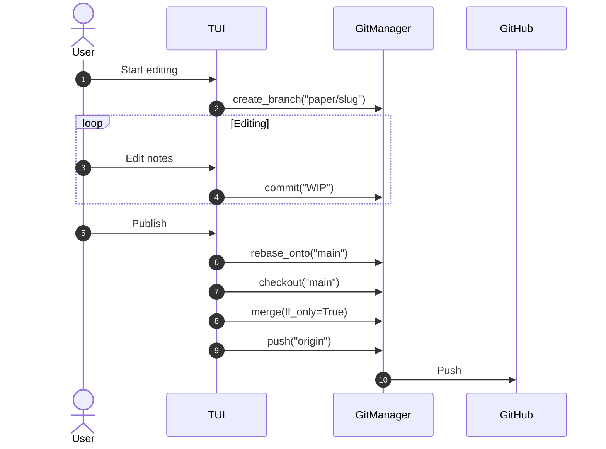

---

## LLM Integration

Shannon uses local LLMs for paper extraction via OpenAI-compatible APIs.

### Supported Backends

| Backend | URL | Use Case |
|---------|-----|----------|
| LM Studio | `localhost:1234` | Default, GUI-based |
| llama.cpp | `localhost:8080` | Lightweight, CLI |
| OpenRouter | `openrouter.ai` | Cloud fallback |

### Default Model

- **Model**: GPT-OSS 20B
- **Context Window**: 8,192 tokens
- **Use Cases**: Paper extraction, summarization, note generation

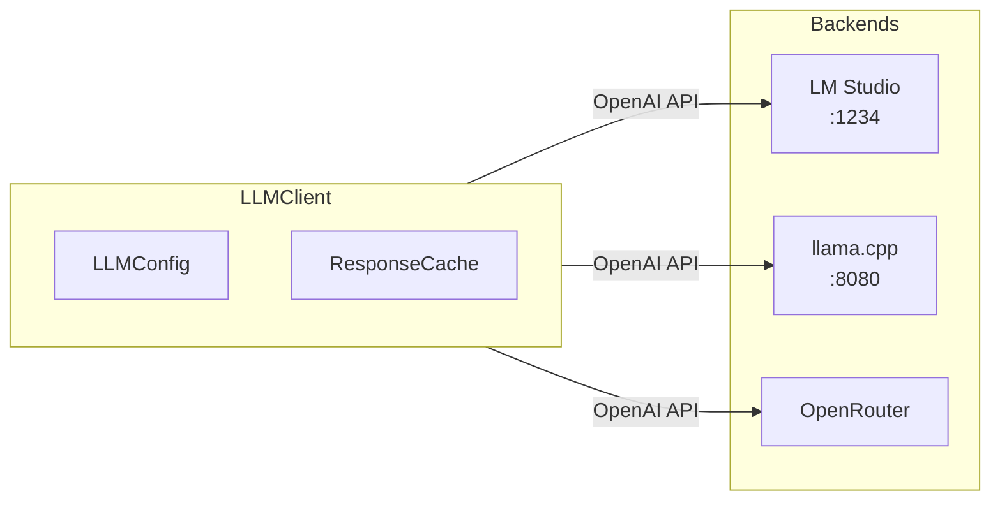

---

## Event System

Components communicate through a publish/subscribe event bus.

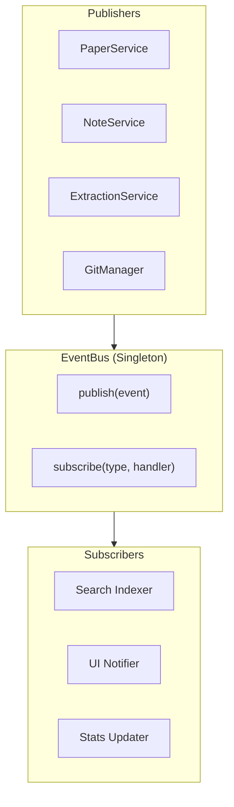

### Event Types

| Event | Trigger | Subscribers |
|-------|---------|-------------|
| `PaperCreatedEvent` | Paper imported | Search indexer, UI |
| `NoteUpdatedEvent` | Note edited | Search indexer |
| `ExtractionCompletedEvent` | LLM extraction done | UI notifier |
| `GitCommitEvent` | Changes committed | Stats updater |

---

## Deployment

### Installation

```bash
curl -LsSf https://raw.githubusercontent.com/user/shannon/main/scripts/install.sh | sh
```

### Local Architecture

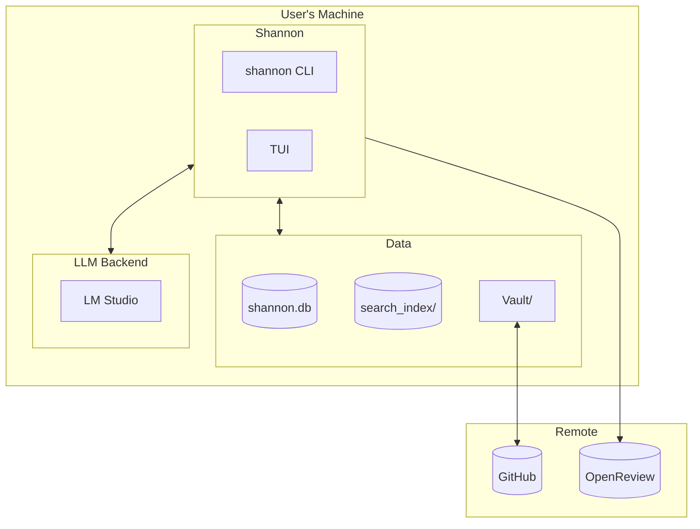

---

## Technology Stack

| Component | Technology | Purpose |
|-----------|------------|---------|
| Language | Python 3.12+ | Core application |
| TUI Framework | Textual | Terminal interface |
| CLI Framework | Typer | Command-line interface |
| Database | SQLite | Local data storage |
| Search | Tantivy | Full-text search |
| Git | GitPython | Version control |
| HTTP | httpx | Async HTTP client |
| LLM | OpenAI-compatible | Paper extraction |
| PDF | PyMuPDF | PDF parsing |
| Validation | Pydantic | Data validation |
| Linting | Fixit2 | Note standardization |

---

## Design Principles

1. **Local-First**: All data stored locally, works offline
2. **Git-Native**: Every change is versioned
3. **Protocol-Based**: Interfaces enable testing and flexibility
4. **Event-Driven**: Decoupled components via pub/sub
5. **Result Types**: Explicit error handling without exceptions
6. **Obsidian Compatible**: Standard markdown, wiki-links

---

## Related Documentation

- [Core Module Summary](core_module_summary.md) - Detailed core module API
- [Database Schema](database_schema.md) - Complete database documentation
- [Directory Summary](directory_summary.md) - Project file structure
