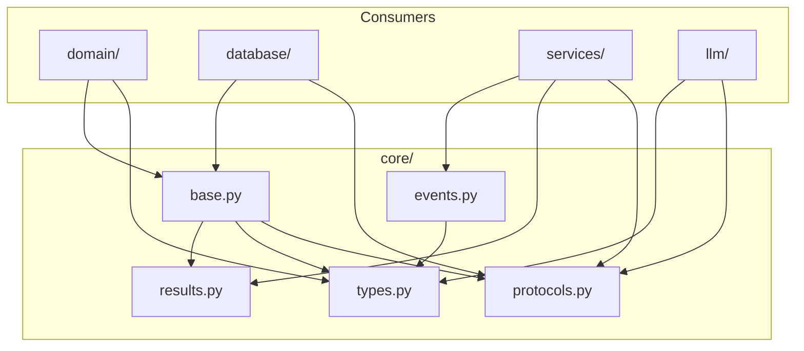

# Core Module Summary

The `src/core/` module provides the foundational abstractions, protocols, and types that define contracts across the entire Shannon application.

---

## Module Structure

```
src/core/
├── __init__.py       # Public exports
├── protocols.py      # Interface definitions
├── base.py           # Abstract base classes
├── types.py          # Type aliases and TypedDicts
├── results.py        # Result monad (Ok/Err)
└── events.py         # Event system
```

---

## File Descriptions

### `protocols.py` - Interface Definitions

Runtime-checkable Protocol classes that define interfaces for dependency injection and testing.

#### Repository Protocols

```python
@runtime_checkable
class Repository(Protocol[T, ID]):
    """Base repository protocol for data access."""
    
    def get_by_id(self, entity_id: ID) -> Optional[T]: ...
    def get_all(self) -> Sequence[T]: ...
    def save(self, entity: T) -> T: ...
    def delete(self, entity_id: ID) -> bool: ...
    def exists(self, entity_id: ID) -> bool: ...


@runtime_checkable
class PaginatedRepository(Repository[T, ID], Protocol):
    """Repository with pagination support."""
    
    def get_paginated(
        self,
        page: int = 1,
        page_size: int = 20,
        filters: Optional[dict[str, Any]] = None,
    ) -> PaginatedResult[T]: ...
```

#### Service Protocols

```python
@runtime_checkable
class Service(Protocol):
    """Base service protocol."""
    
    def health_check(self) -> bool: ...


@runtime_checkable
class CRUDService(Protocol[T, ID]):
    """Service with standard CRUD operations."""
    
    def get(self, entity_id: ID) -> Optional[T]: ...
    def list(self, filters: Optional[dict] = None) -> Sequence[T]: ...
    def create(self, data: dict[str, Any]) -> T: ...
    def update(self, entity_id: ID, data: dict[str, Any]) -> T: ...
    def delete(self, entity_id: ID) -> bool: ...
```

#### Infrastructure Protocols

```python
@runtime_checkable
class LLMClient(Protocol):
    """Protocol for OpenAI-compatible LLM clients."""
    
    @property
    def model(self) -> str: ...
    
    @property
    def max_context_tokens(self) -> int: ...
    
    async def complete(
        self,
        messages: Sequence[LLMMessage],
        temperature: float = 0.7,
        max_tokens: Optional[int] = None,
    ) -> LLMResponse: ...
    
    async def stream(
        self,
        messages: Sequence[LLMMessage],
        temperature: float = 0.7,
    ) -> AsyncIterator[str]: ...
    
    async def health_check(self) -> bool: ...


@runtime_checkable
class SearchEngine(Protocol):
    """Protocol for full-text search operations."""
    
    def index(self, content_id: str, body: str, metadata: dict) -> None: ...
    def search(self, query: str, limit: int = 20) -> Sequence[SearchResult]: ...
    def delete(self, content_id: str) -> bool: ...
    def commit(self) -> None: ...


@runtime_checkable
class GitProvider(Protocol):
    """Protocol for Git operations."""
    
    @property
    def current_branch(self) -> str: ...
    
    @property
    def is_dirty(self) -> bool: ...
    
    def create_branch(self, branch_name: str) -> None: ...
    def checkout(self, branch_name: str) -> None: ...
    def commit(self, message: str) -> str: ...
    def rebase_onto(self, target_branch: str) -> bool: ...
```

---

### `base.py` - Abstract Base Classes

Abstract base classes with shared implementation logic.

#### BaseModel

```python
@dataclass
class BaseModel(ABC):
    """Abstract base for all domain models."""
    
    created_at: datetime = field(default_factory=datetime.now)
    
    @property
    @abstractmethod
    def id(self) -> EntityId:
        """Return the entity's unique identifier."""
        ...
    
    def to_dict(self) -> dict[str, Any]:
        """Convert model to dictionary."""
        return asdict(self)
    
    @classmethod
    @abstractmethod
    def from_row(cls, row: sqlite3.Row) -> "BaseModel":
        """Create instance from database row."""
        ...
```

#### BaseRepository

```python
class BaseRepository(ABC, Generic[T, ID]):
    """Abstract base repository with common CRUD operations."""
    
    def __init__(self, connection: sqlite3.Connection):
        self._conn = connection
    
    @property
    @abstractmethod
    def table_name(self) -> str: ...
    
    @property
    @abstractmethod
    def id_column(self) -> str: ...
    
    @abstractmethod
    def _row_to_entity(self, row: sqlite3.Row) -> T: ...
    
    @abstractmethod
    def _entity_to_params(self, entity: T) -> dict[str, Any]: ...
    
    # Implemented methods
    def get_by_id(self, entity_id: ID) -> Optional[T]: ...
    def get_all(self) -> Sequence[T]: ...
    def exists(self, entity_id: ID) -> bool: ...
    def delete(self, entity_id: ID) -> bool: ...
    def count(self, filters: Optional[dict] = None) -> int: ...
    def get_paginated(self, page: int, page_size: int) -> PaginatedResult[T]: ...
    
    @abstractmethod
    def save(self, entity: T) -> T: ...
```

#### BaseService

```python
class BaseService(ABC):
    """Abstract base service."""
    
    def health_check(self) -> bool:
        return True
    
    @abstractmethod
    def _validate(self, data: dict[str, Any]) -> None:
        """Validate input data. Raises ValueError on invalid."""
        ...


class BaseCRUDService(BaseService, Generic[T, ID]):
    """Abstract base for services with CRUD operations."""
    
    def __init__(self, repository: BaseRepository[T, ID]):
        self._repo = repository
    
    def get(self, entity_id: ID) -> Optional[T]: ...
    def list(self, filters: Optional[dict] = None) -> Sequence[T]: ...
    def delete(self, entity_id: ID) -> bool: ...
    
    @abstractmethod
    def create(self, data: dict[str, Any]) -> T: ...
    
    @abstractmethod
    def update(self, entity_id: ID, data: dict[str, Any]) -> T: ...
```

---

### `types.py` - Type Definitions

Type aliases, NewTypes, and TypedDicts for type safety.

#### Entity IDs

```python
EntityId = NewType("EntityId", str)
UserId = NewType("UserId", str)       # GitHub username
PaperId = NewType("PaperId", str)     # OpenReview ID
PageId = NewType("PageId", str)       # UUID
NoteId = NewType("NoteId", str)       # UUID
ContentId = NewType("ContentId", str) # UUID
TagId = NewType("TagId", str)         # UUID
```

#### Generic Containers

```python
@dataclass(frozen=True)
class PaginatedResult(Generic[T]):
    """Container for paginated query results."""
    items: Sequence[T]
    total: int
    page: int
    page_size: int
    total_pages: int
    
    @property
    def has_next(self) -> bool: ...
    
    @property
    def has_previous(self) -> bool: ...


@dataclass(frozen=True)
class SearchResult:
    """A single search result from Tantivy."""
    content_id: ContentId
    score: float
    snippet: str
    content_type: str
    paper_id: Optional[PaperId] = None
    paper_title: Optional[str] = None
    page_title: Optional[str] = None
```

#### LLM Types

```python
class LLMBackend(str, Enum):
    """Supported LLM backends."""
    LM_STUDIO = "lm_studio"
    LLAMA_CPP = "llama_cpp"
    OPENROUTER = "openrouter"


class LLMRole(str, Enum):
    """Message roles for LLM conversations."""
    SYSTEM = "system"
    USER = "user"
    ASSISTANT = "assistant"


@dataclass(frozen=True)
class LLMMessage:
    """A single message in an LLM conversation."""
    role: LLMRole
    content: str
    
    def to_dict(self) -> dict[str, str]: ...


@dataclass(frozen=True)
class LLMResponse:
    """Response from an LLM."""
    content: str
    model: str
    usage: Optional[TokenUsage] = None
    finish_reason: str = "stop"
    cached: bool = False


@dataclass
class ExtractionResult:
    """Result of an extraction operation."""
    extraction_type: str
    success: bool
    data: dict[str, Any]
    confidence: float
    raw_response: str
    errors: list[str] = field(default_factory=list)
```

#### Input TypedDicts

```python
class CreatePaperInput(TypedDict, total=False):
    openreview_id: str  # Required
    title: str          # Required
    abstract: str
    pdf_url: str


class CreatePageInput(TypedDict, total=False):
    paper_id: str       # Required
    title: str          # Required
    category: str
    purpose: str
    position: int


class CreateNoteInput(TypedDict, total=False):
    page_id: str        # Required
    content: str        # Required
    note_type: str
    position: int
```

---

### `results.py` - Result Monad

Result type for explicit error handling without exceptions.

```python
@dataclass(frozen=True)
class Ok(Generic[T]):
    """Represents a successful result."""
    value: T
    
    def is_ok(self) -> bool: return True
    def is_err(self) -> bool: return False
    def unwrap(self) -> T: return self.value
    def unwrap_or(self, default: T) -> T: return self.value
    def map(self, fn: Callable[[T], U]) -> Result[U, Any]: ...
    def and_then(self, fn: Callable[[T], Result[U, E]]) -> Result[U, E]: ...


@dataclass(frozen=True)
class Err(Generic[E]):
    """Represents a failed result."""
    error: E
    
    def is_ok(self) -> bool: return False
    def is_err(self) -> bool: return True
    def unwrap(self) -> Any: raise self.error
    def unwrap_or(self, default: T) -> T: return default
    def map(self, fn: Callable[[Any], U]) -> Result[U, E]: return self
    def and_then(self, fn: Callable[[Any], Result[U, E]]) -> Result[U, E]: return self


Result = Union[Ok[T], Err[E]]


# Helper functions
def try_call(fn: Callable[[], T], *exceptions) -> Result[T, Exception]: ...
def collect_results(results: list[Result[T, E]]) -> Result[list[T], E]: ...
```

#### Usage Examples

```python
# Instead of exceptions
def get_paper(paper_id: str) -> Result[Paper, PaperNotFoundError]:
    paper = repo.get_by_id(paper_id)
    if paper is None:
        return Err(PaperNotFoundError(paper_id))
    return Ok(paper)

# Chaining operations
result = (
    get_paper(paper_id)
    .and_then(lambda p: get_pages(p.paper_id))
    .map(lambda pages: [p.title for p in pages])
)

if result.is_ok():
    titles = result.unwrap()
else:
    handle_error(result.error)
```

---

### `events.py` - Event System

Event definitions and EventBus for decoupled communication.

#### Base Event

```python
@dataclass(frozen=True)
class BaseEvent:
    """Base class for all events."""
    timestamp: float = field(default_factory=lambda: datetime.now().timestamp())
    
    @property
    def event_type(self) -> str:
        return self.__class__.__name__
```

#### Domain Events

```python
@dataclass(frozen=True)
class PaperCreatedEvent(BaseEvent):
    paper_id: str
    title: str
    created_by: str


@dataclass(frozen=True)
class NoteCreatedEvent(BaseEvent):
    note_id: str
    page_id: str
    content_id: str


@dataclass(frozen=True)
class NoteUpdatedEvent(BaseEvent):
    note_id: str
    content_id: str


@dataclass(frozen=True)
class ExtractionStartedEvent(BaseEvent):
    paper_id: str
    extraction_types: list[str]


@dataclass(frozen=True)
class ExtractionCompletedEvent(BaseEvent):
    paper_id: str
    success: bool
    pages_created: int


@dataclass(frozen=True)
class GitCommitEvent(BaseEvent):
    commit_hash: str
    message: str
    files_changed: int
```

#### EventBus

```python
class EventBus:
    """Simple synchronous event bus (singleton)."""
    
    _instance: Optional["EventBus"] = None
    
    def subscribe(self, event_type: str, handler: Callable[[BaseEvent], None]) -> None:
        """Subscribe a handler to an event type."""
        ...
    
    def unsubscribe(self, event_type: str, handler: Callable) -> None:
        """Unsubscribe a handler."""
        ...
    
    def publish(self, event: BaseEvent) -> None:
        """Publish an event to all subscribers."""
        ...
    
    def clear(self) -> None:
        """Clear all subscribers (for testing)."""
        ...


def get_event_bus() -> EventBus:
    """Get the singleton EventBus instance."""
    return EventBus()
```

#### Usage Example

```python
# Subscribe to events
event_bus = get_event_bus()

def on_note_created(event: NoteCreatedEvent):
    search_service.index_content(event.content_id)

event_bus.subscribe("NoteCreatedEvent", on_note_created)

# Publish events
event_bus.publish(NoteCreatedEvent(
    note_id="note-123",
    page_id="page-456",
    content_id="content-789",
))
```

---

## Module Dependencies



---

## Design Rationale

| Component | Why |
|-----------|-----|
| **Protocols** | Enable dependency injection, mocking, and testing |
| **Base Classes** | Reduce boilerplate, ensure consistency |
| **NewTypes** | Prevent ID type confusion at compile time |
| **TypedDicts** | Validate input shapes for service methods |
| **Result Type** | Explicit error handling, chainable operations |
| **EventBus** | Decouple components, enable extensibility |

---

## Public Exports

```python
# core/__init__.py
from shannon.core.protocols import (
    Repository, Service, LLMClient, SearchEngine, GitProvider,
)
from shannon.core.base import (
    BaseRepository, BaseService, BaseCRUDService, BaseModel,
)
from shannon.core.types import (
    EntityId, UserId, PaperId, PageId, NoteId, ContentId,
    PaginatedResult, SearchResult, LLMMessage, LLMResponse,
    ExtractionResult, LLMBackend, LLMRole,
)
from shannon.core.results import Result, Ok, Err, try_call, collect_results
from shannon.core.events import (
    BaseEvent, EventBus, get_event_bus,
    PaperCreatedEvent, NoteCreatedEvent, NoteUpdatedEvent,
)
```

---

## Related Documentation

- [Architecture](architecture.md) - System architecture overview
- [Database Schema](database_schema.md) - Database table definitions
- [Directory Summary](directory_summary.md) - Project file structure
