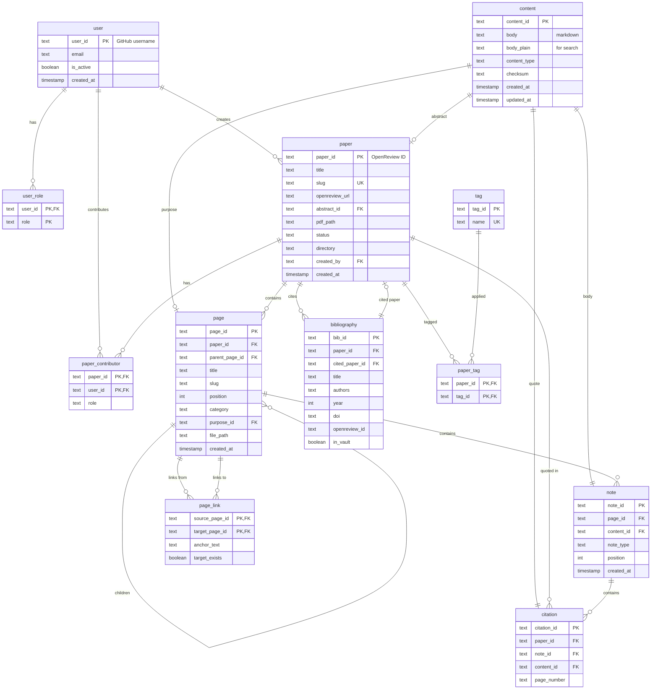

# Shannon Database Schema

## Overview

Shannon uses SQLite as its local database engine, designed for:

- **Full-text search** via Tantivy (centralized `content` table)
- **Hierarchical organization** (papers → pages → notes)
- **Git-based collaboration** (user tracking, contributors)
- **OpenReview integration** (paper imports)

**Total Tables**: 12

---

## Entity Relationship Diagram



---

## Tables Reference

### User Management

#### `user`

Platform users identified by GitHub username.

| Column | Type | Constraints | Description |
|--------|------|-------------|-------------|
| `user_id` | TEXT | PRIMARY KEY | GitHub username |
| `email` | TEXT | | Email address |
| `is_active` | BOOLEAN | DEFAULT TRUE | Active in group |
| `created_at` | TIMESTAMP | DEFAULT CURRENT_TIMESTAMP | Creation time |

```sql
CREATE TABLE user (
    user_id     TEXT PRIMARY KEY,
    email       TEXT,
    is_active   BOOLEAN DEFAULT TRUE,
    created_at  TIMESTAMP DEFAULT CURRENT_TIMESTAMP
);

CREATE INDEX idx_user_active ON user(is_active) WHERE is_active = TRUE;
```

#### `user_role`

Global roles for permission management.

| Column | Type | Constraints | Description |
|--------|------|-------------|-------------|
| `user_id` | TEXT | PK, FK → user | User reference |
| `role` | TEXT | PK | Role name |

**Valid Roles**: `admin`, `writer`, `reviewer`

```sql
CREATE TABLE user_role (
    user_id TEXT REFERENCES user(user_id) ON DELETE CASCADE,
    role    TEXT NOT NULL,
    PRIMARY KEY (user_id, role)
);
```

---

### Content Management

#### `content`

Centralized searchable text content for Tantivy integration.

| Column | Type | Constraints | Description |
|--------|------|-------------|-------------|
| `content_id` | TEXT | PRIMARY KEY | UUID |
| `body` | TEXT | NOT NULL | Original markdown |
| `body_plain` | TEXT | | Stripped plaintext |
| `content_type` | TEXT | DEFAULT 'note' | Type discriminator |
| `checksum` | TEXT | | Hash for change detection |
| `created_at` | TIMESTAMP | DEFAULT CURRENT_TIMESTAMP | Creation time |
| `updated_at` | TIMESTAMP | DEFAULT CURRENT_TIMESTAMP | Last modified |

**Content Types**: `note`, `abstract`, `purpose`, `citation`

```sql
CREATE TABLE content (
    content_id   TEXT PRIMARY KEY,
    body         TEXT NOT NULL,
    body_plain   TEXT,
    content_type TEXT DEFAULT 'note',
    checksum     TEXT,
    created_at   TIMESTAMP DEFAULT CURRENT_TIMESTAMP,
    updated_at   TIMESTAMP DEFAULT CURRENT_TIMESTAMP
);

CREATE INDEX idx_content_type ON content(content_type);
CREATE INDEX idx_content_checksum ON content(checksum);
CREATE INDEX idx_content_updated ON content(updated_at);
```

**Tantivy Integration**:

```
┌─────────────────────────────────────────┐
│           Tantivy Document              │
├─────────────────────────────────────────┤
│  content_id: "uuid"                     │
│  body: "from body_plain"                │
│  content_type: "note"                   │
│  paper_id: "denormalized"               │
│  page_title: "denormalized"             │
└─────────────────────────────────────────┘
```

---

### Paper Management

#### `paper`

Academic papers imported from OpenReview.

| Column | Type | Constraints | Description |
|--------|------|-------------|-------------|
| `paper_id` | TEXT | PRIMARY KEY | OpenReview ID |
| `title` | TEXT | NOT NULL | Paper title |
| `slug` | TEXT | UNIQUE, NOT NULL | Filesystem-safe name |
| `openreview_url` | TEXT | NOT NULL | OpenReview URL |
| `abstract_id` | TEXT | FK → content | Abstract content |
| `pdf_path` | TEXT | | Local PDF path |
| `status` | TEXT | DEFAULT 'inbox' | Workflow status |
| `directory` | TEXT | DEFAULT 'inbox' | Vault directory |
| `created_by` | TEXT | FK → user | Importing user |
| `created_at` | TIMESTAMP | DEFAULT CURRENT_TIMESTAMP | Import time |

**Status Values**:

| Status | Description |
|--------|-------------|
| `inbox` | Newly added |
| `in_progress` | Being worked on |
| `review` | Ready for review |
| `published` | Complete |
| `archived` | No longer active |

**Directory Values**:

| Directory | Path | Description |
|-----------|------|-------------|
| `inbox` | `01_Inbox/` | Landing zone |
| `papers` | `10_Papers/` | Active papers |
| `concepts` | `20_Concepts/` | Concept definitions |
| `algorithms` | `30_Algorithms/` | Algorithm docs |

```sql
CREATE TABLE paper (
    paper_id       TEXT PRIMARY KEY,
    title          TEXT NOT NULL,
    slug           TEXT NOT NULL UNIQUE,
    openreview_url TEXT NOT NULL,
    abstract_id    TEXT REFERENCES content(content_id),
    pdf_path       TEXT,
    status         TEXT DEFAULT 'inbox',
    directory      TEXT DEFAULT 'inbox',
    created_by     TEXT REFERENCES user(user_id),
    created_at     TIMESTAMP DEFAULT CURRENT_TIMESTAMP
);

CREATE INDEX idx_paper_status ON paper(status);
CREATE INDEX idx_paper_directory ON paper(directory);
CREATE INDEX idx_paper_created_by ON paper(created_by);
CREATE INDEX idx_paper_created_at ON paper(created_at DESC);
```

#### `paper_contributor`

Users contributing to papers.

| Column | Type | Constraints | Description |
|--------|------|-------------|-------------|
| `paper_id` | TEXT | PK, FK → paper | Paper reference |
| `user_id` | TEXT | PK, FK → user | User reference |
| `role` | TEXT | NOT NULL | Contributor role |

**Roles**: `lead`, `contributor`, `reviewer`

```sql
CREATE TABLE paper_contributor (
    paper_id TEXT REFERENCES paper(paper_id) ON DELETE CASCADE,
    user_id  TEXT REFERENCES user(user_id) ON DELETE CASCADE,
    role     TEXT NOT NULL,
    PRIMARY KEY (paper_id, user_id)
);

CREATE INDEX idx_contributor_user ON paper_contributor(user_id);
```

---

### Page Management

#### `page`

Sections within a paper, supporting hierarchy.

| Column | Type | Constraints | Description |
|--------|------|-------------|-------------|
| `page_id` | TEXT | PRIMARY KEY | UUID |
| `paper_id` | TEXT | FK → paper, NOT NULL | Parent paper |
| `parent_page_id` | TEXT | FK → page | Parent page |
| `title` | TEXT | NOT NULL | Section title |
| `slug` | TEXT | NOT NULL | URL-safe name |
| `position` | INTEGER | DEFAULT 0 | Sort order |
| `category` | TEXT | | Section type |
| `purpose_id` | TEXT | FK → content | Purpose description |
| `file_path` | TEXT | | Markdown file path |
| `created_at` | TIMESTAMP | DEFAULT CURRENT_TIMESTAMP | Creation time |

**Categories**: `introduction`, `background`, `methodology`, `results`, `discussion`, `conclusion`, `algorithm`, `concept`, `appendix`

```sql
CREATE TABLE page (
    page_id        TEXT PRIMARY KEY,
    paper_id       TEXT NOT NULL REFERENCES paper(paper_id) ON DELETE CASCADE,
    parent_page_id TEXT REFERENCES page(page_id) ON DELETE SET NULL,
    title          TEXT NOT NULL,
    slug           TEXT NOT NULL,
    position       INTEGER DEFAULT 0,
    category       TEXT,
    purpose_id     TEXT REFERENCES content(content_id),
    file_path      TEXT,
    created_at     TIMESTAMP DEFAULT CURRENT_TIMESTAMP,
    UNIQUE(paper_id, slug)
);

CREATE INDEX idx_page_paper ON page(paper_id);
CREATE INDEX idx_page_parent ON page(parent_page_id);
CREATE INDEX idx_page_position ON page(paper_id, position);
```

**Hierarchical Query**:

```sql
WITH RECURSIVE page_tree AS (
    SELECT page_id, title, slug, position, 0 as depth
    FROM page
    WHERE paper_id = ? AND parent_page_id IS NULL
    
    UNION ALL
    
    SELECT p.page_id, p.title, p.slug, p.position, pt.depth + 1
    FROM page p
    JOIN page_tree pt ON p.parent_page_id = pt.page_id
)
SELECT * FROM page_tree ORDER BY depth, position;
```

---

### Note Management

#### `note`

Content blocks within pages.

| Column | Type | Constraints | Description |
|--------|------|-------------|-------------|
| `note_id` | TEXT | PRIMARY KEY | UUID |
| `page_id` | TEXT | FK → page, NOT NULL | Parent page |
| `content_id` | TEXT | FK → content | Content body |
| `note_type` | TEXT | DEFAULT 'text' | Content type |
| `position` | INTEGER | DEFAULT 0 | Sort order |
| `created_at` | TIMESTAMP | DEFAULT CURRENT_TIMESTAMP | Creation time |

**Note Types**: `text`, `formula`, `code`, `image`, `callout`, `quote`

```sql
CREATE TABLE note (
    note_id    TEXT PRIMARY KEY,
    page_id    TEXT NOT NULL REFERENCES page(page_id) ON DELETE CASCADE,
    content_id TEXT REFERENCES content(content_id) ON DELETE CASCADE,
    note_type  TEXT DEFAULT 'text',
    position   INTEGER DEFAULT 0,
    created_at TIMESTAMP DEFAULT CURRENT_TIMESTAMP
);

CREATE INDEX idx_note_page ON note(page_id);
CREATE INDEX idx_note_content ON note(content_id);
CREATE INDEX idx_note_position ON note(page_id, position);
```

---

### Cross-References

#### `page_link`

Internal wiki-style links between pages.

| Column | Type | Constraints | Description |
|--------|------|-------------|-------------|
| `source_page_id` | TEXT | PK, FK → page | Link source |
| `target_page_id` | TEXT | PK, FK → page | Link target |
| `anchor_text` | TEXT | | Display text |
| `target_exists` | BOOLEAN | DEFAULT TRUE | Target exists |

```sql
CREATE TABLE page_link (
    source_page_id TEXT REFERENCES page(page_id) ON DELETE CASCADE,
    target_page_id TEXT REFERENCES page(page_id) ON DELETE CASCADE,
    anchor_text    TEXT,
    target_exists  BOOLEAN DEFAULT TRUE,
    PRIMARY KEY (source_page_id, target_page_id)
);

CREATE INDEX idx_link_target ON page_link(target_page_id);
CREATE INDEX idx_link_pending ON page_link(target_exists) WHERE target_exists = FALSE;
```

---

### Citations

#### `citation`

Direct quotes from original papers.

| Column | Type | Constraints | Description |
|--------|------|-------------|-------------|
| `citation_id` | TEXT | PRIMARY KEY | UUID |
| `paper_id` | TEXT | FK → paper, NOT NULL | Source paper |
| `note_id` | TEXT | FK → note | Containing note |
| `content_id` | TEXT | FK → content | Quote text |
| `page_number` | TEXT | | Page reference |

```sql
CREATE TABLE citation (
    citation_id TEXT PRIMARY KEY,
    paper_id    TEXT NOT NULL REFERENCES paper(paper_id) ON DELETE CASCADE,
    note_id     TEXT REFERENCES note(note_id) ON DELETE CASCADE,
    content_id  TEXT REFERENCES content(content_id) ON DELETE CASCADE,
    page_number TEXT
);

CREATE INDEX idx_citation_paper ON citation(paper_id);
CREATE INDEX idx_citation_note ON citation(note_id);
```

---

### Bibliography

#### `bibliography`

Referenced papers in bibliography sections.

| Column | Type | Constraints | Description |
|--------|------|-------------|-------------|
| `bib_id` | TEXT | PRIMARY KEY | UUID |
| `paper_id` | TEXT | FK → paper, NOT NULL | Referencing paper |
| `cited_paper_id` | TEXT | FK → paper | If in vault |
| `title` | TEXT | NOT NULL | Referenced title |
| `authors` | TEXT | | Author names |
| `year` | INTEGER | | Publication year |
| `doi` | TEXT | | DOI |
| `openreview_id` | TEXT | | OpenReview ID |
| `in_vault` | BOOLEAN | DEFAULT FALSE | In our vault |

```sql
CREATE TABLE bibliography (
    bib_id         TEXT PRIMARY KEY,
    paper_id       TEXT NOT NULL REFERENCES paper(paper_id) ON DELETE CASCADE,
    cited_paper_id TEXT REFERENCES paper(paper_id) ON DELETE SET NULL,
    title          TEXT NOT NULL,
    authors        TEXT,
    year           INTEGER,
    doi            TEXT,
    openreview_id  TEXT,
    in_vault       BOOLEAN DEFAULT FALSE
);

CREATE INDEX idx_bib_paper ON bibliography(paper_id);
CREATE INDEX idx_bib_in_vault ON bibliography(in_vault);
CREATE INDEX idx_bib_openreview ON bibliography(openreview_id) WHERE openreview_id IS NOT NULL;
```

---

### Tagging

#### `tag`

Categorization tags.

```sql
CREATE TABLE tag (
    tag_id TEXT PRIMARY KEY,
    name   TEXT NOT NULL UNIQUE
);
```

#### `paper_tag`

Paper-tag associations.

```sql
CREATE TABLE paper_tag (
    paper_id TEXT REFERENCES paper(paper_id) ON DELETE CASCADE,
    tag_id   TEXT REFERENCES tag(tag_id) ON DELETE CASCADE,
    PRIMARY KEY (paper_id, tag_id)
);

CREATE INDEX idx_paper_tag_tag ON paper_tag(tag_id);
```

---

## Common Queries

### Paper with Statistics

```sql
SELECT 
    p.*,
    c.body as abstract,
    COUNT(DISTINCT pc.user_id) as contributor_count,
    COUNT(DISTINCT pg.page_id) as page_count
FROM paper p
LEFT JOIN content c ON p.abstract_id = c.content_id
LEFT JOIN paper_contributor pc ON p.paper_id = pc.paper_id
LEFT JOIN page pg ON p.paper_id = pg.paper_id
WHERE p.paper_id = ?
GROUP BY p.paper_id;
```

### Page Tree

```sql
WITH RECURSIVE page_tree AS (
    SELECT page_id, title, slug, position, parent_page_id, 0 as depth
    FROM page WHERE paper_id = ? AND parent_page_id IS NULL
    UNION ALL
    SELECT p.page_id, p.title, p.slug, p.position, p.parent_page_id, pt.depth + 1
    FROM page p JOIN page_tree pt ON p.parent_page_id = pt.page_id
)
SELECT * FROM page_tree ORDER BY depth, position;
```

### Content for Indexing

```sql
SELECT 
    c.content_id,
    c.body_plain,
    c.content_type,
    COALESCE(p.paper_id, p2.paper_id, p3.paper_id) as paper_id,
    COALESCE(p.title, p2.title, p3.title) as paper_title,
    pg.page_id,
    pg.title as page_title
FROM content c
LEFT JOIN paper p ON c.content_id = p.abstract_id
LEFT JOIN page pg ON c.content_id = pg.purpose_id
LEFT JOIN paper p2 ON pg.paper_id = p2.paper_id
LEFT JOIN note n ON c.content_id = n.content_id
LEFT JOIN page pg2 ON n.page_id = pg2.page_id
LEFT JOIN paper p3 ON pg2.paper_id = p3.paper_id;
```

### Backlinks

```sql
SELECT 
    p.page_id,
    p.title,
    pa.title as paper_title,
    pl.anchor_text
FROM page_link pl
JOIN page p ON pl.source_page_id = p.page_id
JOIN paper pa ON p.paper_id = pa.paper_id
WHERE pl.target_page_id = ?;
```

---

## Foreign Key Actions

| Relationship | ON DELETE | Reason |
|--------------|-----------|--------|
| paper → user | SET NULL | Keep paper if user leaves |
| paper → content | SET NULL | Paper can exist without abstract |
| paper_contributor → paper | CASCADE | Remove with paper |
| page → paper | CASCADE | Remove with paper |
| page → page (parent) | SET NULL | Promote to root |
| note → page | CASCADE | Remove with page |
| note → content | CASCADE | Remove with content |
| citation → paper | CASCADE | Remove with paper |
| bibliography → paper (cited) | SET NULL | Keep ref if cited removed |

---

## Migration Tracking

```sql
CREATE TABLE _migrations (
    version    INTEGER PRIMARY KEY,
    name       TEXT NOT NULL,
    applied_at TIMESTAMP DEFAULT CURRENT_TIMESTAMP
);
```

---

## Performance Indexes

| Table | Index | Purpose |
|-------|-------|---------|
| `user` | `is_active` (partial) | Active user lookup |
| `content` | `checksum` | Change detection |
| `content` | `updated_at` | Incremental indexing |
| `paper` | `status`, `directory` | Filtering |
| `page` | `paper_id, position` | Ordered retrieval |
| `note` | `page_id, position` | Ordered retrieval |
| `page_link` | `target_exists` (partial) | Broken links |
| `bibliography` | `in_vault` | Importable refs |

---

## Related Documentation

- [Architecture](architecture.md) - System architecture overview
- [Core Module Summary](core_module_summary.md) - Core module API
- [Directory Summary](directory_summary.md) - Project file structure
