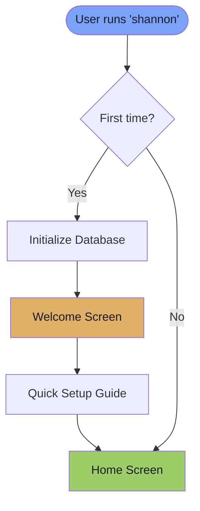
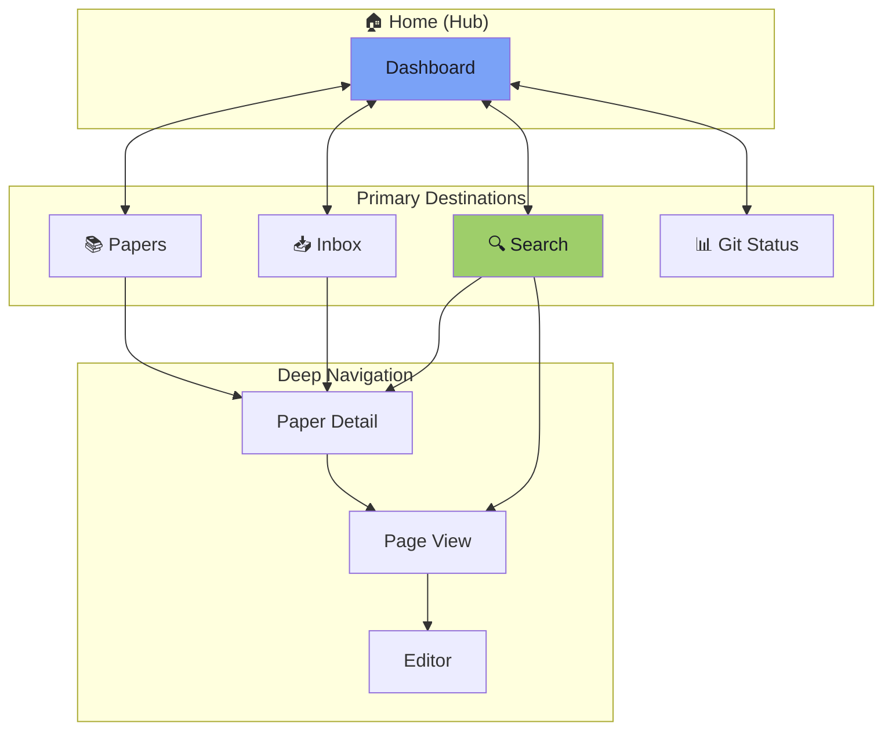
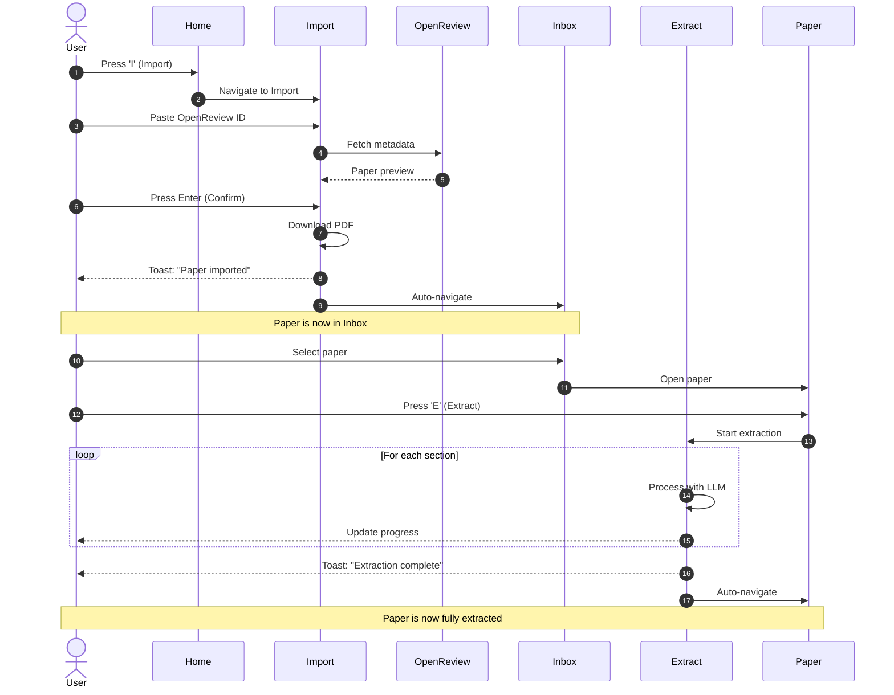
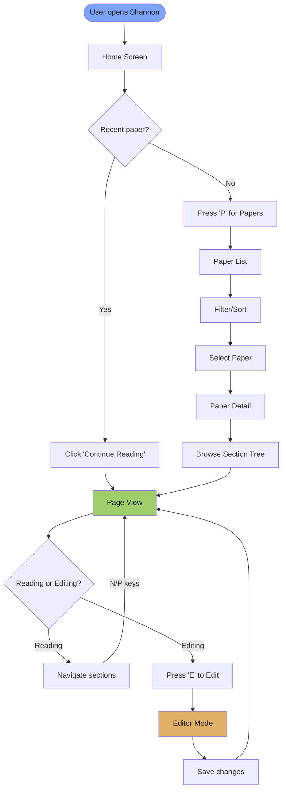
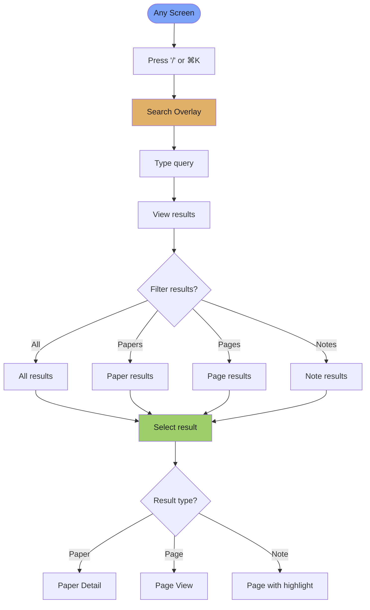
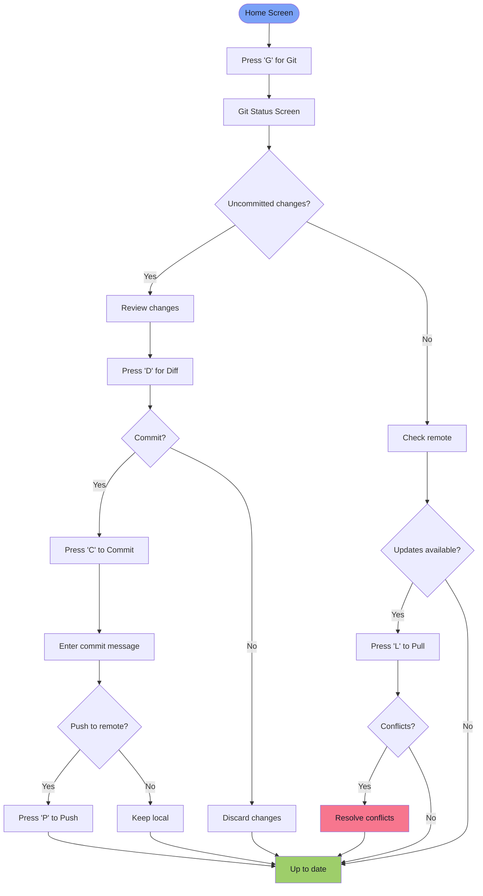
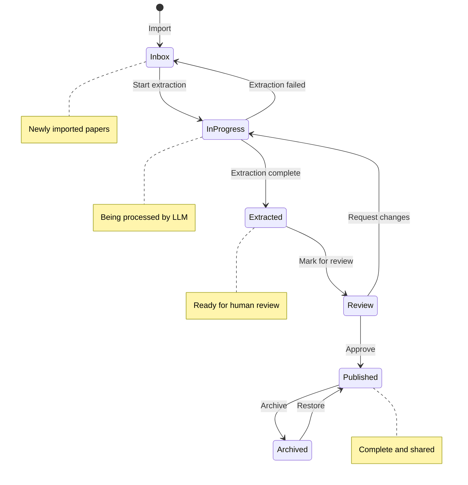
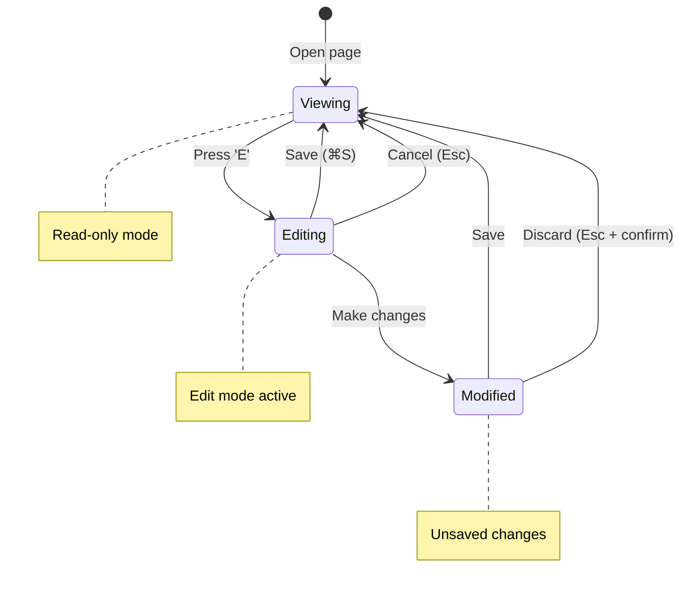
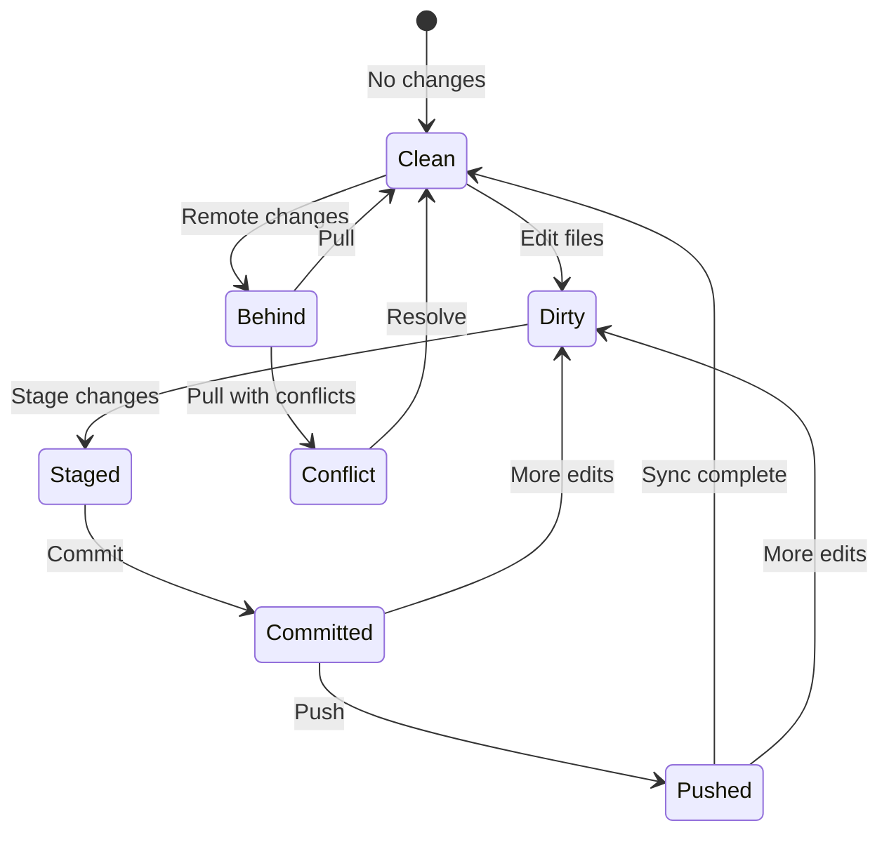
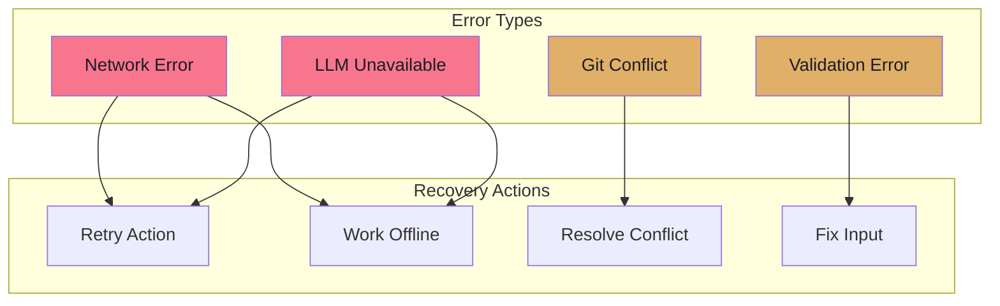

# Shannon User Flow Guide

A comprehensive guide to navigating and using Shannon, designed with Apple's philosophy of intuitive, delightful user experiences.

---

## Table of Contents

1. [Getting Started](#getting-started)
2. [Navigation Model](#navigation-model)
3. [Core User Journeys](#core-user-journeys)
4. [Screen-by-Screen Guide](#screen-by-screen-guide)
5. [Keyboard Shortcuts Reference](#keyboard-shortcuts-reference)
6. [State Transitions](#state-transitions)
7. [Error Handling & Recovery](#error-handling--recovery)

---

## Getting Started

### First Launch Experience



### Entry Points

Shannon can be accessed through two interfaces:

| Entry | Command | Use Case |
|-------|---------|----------|
| **TUI** | `shannon` or `shannon run` | Interactive browsing, reading, editing |
| **CLI** | `shannon <command>` | Quick actions, scripting, automation |

---

## Navigation Model

### Spatial Navigation

Shannon uses a **hub-and-spoke** navigation model with Home as the central hub. This creates a predictable mental model where users always know where they are and how to get back.



### Navigation Principles

1. **One Key Back** — `Esc` or `←` always returns to the previous screen
2. **Universal Search** — `⌘K` or `/` opens search from anywhere
3. **Contextual Actions** — Footer shows only relevant actions for current screen
4. **Breadcrumb Awareness** — Always know your location in the hierarchy

---

## Core User Journeys

### Journey 1: Import & Extract a Paper

The most common workflow for adding new knowledge to Shannon.



### Journey 2: Research & Reading

Exploring existing papers and taking notes.



### Journey 3: Search & Discovery

Finding specific content across all papers.



### Journey 4: Version Control & Collaboration

Managing changes and syncing with team.



---

## Screen-by-Screen Guide

### Home Screen

The dashboard — your starting point and command center.

```
┌─────────────────────────────────────────────────────────────────────┐
│  Shannon                                              ⌘K Search     │
├─────────────────────────────────────────────────────────────────────┤
│                                                                     │
│     Good evening, researcher.                                       │
│                                                                     │
│     ─────────────────────────────────────────────────────────────   │
│                                                                     │
│     CONTINUE READING                                                │
│     ┌─────────────────────────────────────────────────────────┐     │
│     │  Attention Is All You Need                              │     │
│     │  Last edited 2 hours ago · 3.2 Attention Mechanism      │     │
│     └─────────────────────────────────────────────────────────┘     │
│                                                                     │
│     RECENT PAPERS                                                   │
│       Vision Transformer                           yesterday        │
│       BERT: Pre-training Deep Bidirectional        3 days ago       │
│                                                                     │
│     24 papers · 156 pages · 532 notes                               │
│                                                                     │
├─────────────────────────────────────────────────────────────────────┤
│  P Papers   I Import   G Git                               ? Help   │
└─────────────────────────────────────────────────────────────────────┘
```

**Available Actions:**

| Key | Action | Destination |
|-----|--------|-------------|
| `P` | Browse all papers | Paper List |
| `I` | Import new paper | Import Screen |
| `G` | View git status | Git Status |
| `/` | Search | Search Overlay |
| `Enter` | Continue reading | Last viewed page |
| `↑↓` | Navigate recent papers | — |
| `?` | Show help | Help Modal |

---

### Paper List Screen

Your library — browse, filter, and organize papers.

```
┌─────────────────────────────────────────────────────────────────────┐
│  Shannon                                              ⌘K Search     │
├─────────────────────────────────────────────────────────────────────┤
│                                                                     │
│     Papers                                          Filter ▾        │
│     ─────────────────────────────────────────────────────────────   │
│                                                                     │
│     ● Attention Is All You Need                                     │
│       Vaswani et al. · NeurIPS 2017 · Extracted                     │
│                                                                     │
│       Vision Transformer: An Image is Worth 16x16 Words             │
│       Dosovitskiy et al. · ICLR 2021 · Extracted                    │
│                                                                     │
│       BERT: Pre-training of Deep Bidirectional Transformers         │
│       Devlin et al. · NAACL 2019 · In Progress                      │
│                                                                     │
│                                                         Page 1 of 3 │
│                                                                     │
├─────────────────────────────────────────────────────────────────────┤
│  ← Home   ↑↓ Navigate   ⏎ Open   I Import                  ? Help   │
└─────────────────────────────────────────────────────────────────────┘
```

**Available Actions:**

| Key | Action | Result |
|-----|--------|--------|
| `↑↓` | Navigate list | Move selection |
| `Enter` | Open paper | Paper Detail |
| `I` | Import paper | Import Screen |
| `F` | Toggle filter | Filter dropdown |
| `←` or `Esc` | Go back | Home |
| `Page Up/Down` | Paginate | Next/prev page |

**Filter Options:**
- All Papers
- Inbox (newly imported)
- In Progress
- Extracted
- Archived

---

### Paper Detail Screen

Deep dive into a paper's structure and content.

```
┌─────────────────────────────────────────────────────────────────────┐
│  Shannon                                              ⌘K Search     │
├─────────────────────────────────────────────────────────────────────┤
│                                                                     │
│     Attention Is All You Need                                       │
│     Vaswani, Shazeer, Parmar et al. · NeurIPS 2017                  │
│     ─────────────────────────────────────────────────────────────   │
│                                                                     │
│     SECTIONS                                                        │
│       1. Introduction                                               │
│          1.1 Background                                             │
│          1.2 Motivation                                             │
│       2. Related Work                                               │
│     ● 3. Model Architecture                                         │
│          3.1 Encoder and Decoder                                    │
│          3.2 Attention Mechanism                                    │
│       4. Experiments                                                │
│       5. Conclusion                                                 │
│                                                                     │
│     12 pages · 48 notes · Last edited 2h ago                        │
│                                                                     │
├─────────────────────────────────────────────────────────────────────┤
│  ← Papers   ↑↓ Navigate   ⏎ Open   E Extract   O PDF       ? Help   │
└─────────────────────────────────────────────────────────────────────┘
```

**Available Actions:**

| Key | Action | Result |
|-----|--------|--------|
| `↑↓` | Navigate tree | Move selection |
| `Enter` | Open section | Page View |
| `E` | Extract paper | Extraction Screen |
| `O` | Open PDF | System PDF viewer |
| `←` or `Esc` | Go back | Paper List |
| `Tab` | Expand/collapse | Toggle tree node |

---

### Page View Screen

Reading and editing notes — where the real work happens.

```
┌─────────────────────────────────────────────────────────────────────┐
│  Shannon                                              ⌘K Search     │
├─────────────────────────────────────────────────────────────────────┤
│                                                                     │
│     3.2 Attention Mechanism                                         │
│     Attention Is All You Need                                       │
│     ─────────────────────────────────────────────────────────────   │
│                                                                     │
│     The attention mechanism computes a weighted sum of values       │
│     based on a query and keys. This allows the model to focus       │
│     on relevant parts of the input when producing each output.      │
│                                                                     │
│     ## Multi-Head Attention                                         │
│                                                                     │
│     Instead of performing a single attention function, the model    │
│     linearly projects queries, keys and values h times.             │
│                                                                     │
│     ┌───────────────────────────────────────────────────────────┐   │
│     │  Attention(Q,K,V) = softmax(QKᵀ/√dₖ)V                     │   │
│     └───────────────────────────────────────────────────────────┘   │
│                                                                     │
│     > "Attention allows modeling dependencies without regard to     │
│     > their distance in the input or output sequences." — Page 2    │
│                                                                     │
├─────────────────────────────────────────────────────────────────────┤
│  ← Paper   E Edit   A Add Note   N Next   P Prev           ? Help   │
└─────────────────────────────────────────────────────────────────────┘
```

**Available Actions:**

| Key | Action | Result |
|-----|--------|--------|
| `E` | Edit page | Editor Mode |
| `A` | Add note | New note at cursor |
| `N` | Next section | Navigate forward |
| `P` | Previous section | Navigate backward |
| `↑↓` | Scroll content | Scroll viewport |
| `←` or `Esc` | Go back | Paper Detail |

---

### Search Overlay

Universal search — find anything, from anywhere.

```
┌─────────────────────────────────────────────────────────────────────┐
│  Shannon                                              ⌘K Search     │
├─────────────────────────────────────────────────────────────────────┤
│                                                                     │
│     ┌─────────────────────────────────────────────────────────┐     │
│     │  attention mechanism                                    │     │
│     └─────────────────────────────────────────────────────────┘     │
│                                                                     │
│     15 results                                                      │
│     ─────────────────────────────────────────────────────────────   │
│                                                                     │
│     ● Attention Mechanism                                           │
│       Transformer Networks → 3.2 Attention Mechanism                │
│       "...the attention mechanism computes a weighted sum..."       │
│                                                                     │
│       Self-Attention Explained                                      │
│       Transformer Networks → Notes                                  │
│       "...unlike recurrent models, the attention mechanism..."      │
│                                                                     │
│       Attention Calculation                                         │
│       Vision Transformer → Methods                                  │
│       "Attention(Q,K,V) = softmax(QKᵀ/√dₖ)V"                        │
│                                                                     │
├─────────────────────────────────────────────────────────────────────┤
│  Esc Close   ↑↓ Navigate   ⏎ Open                          ? Help   │
└─────────────────────────────────────────────────────────────────────┘
```

**Available Actions:**

| Key | Action | Result |
|-----|--------|--------|
| Type | Search query | Live results |
| `↑↓` | Navigate results | Move selection |
| `Enter` | Open result | Navigate to content |
| `Esc` | Close search | Return to previous |
| `Tab` | Filter scope | Cycle: All/Papers/Pages/Notes |

---

### Import Screen

Add new papers — streamlined and focused.

```
┌─────────────────────────────────────────────────────────────────────┐
│  Shannon                                              ⌘K Search     │
├─────────────────────────────────────────────────────────────────────┤
│                                                                     │
│     Import Paper                                                    │
│                                                                     │
│     ┌─────────────────────────────────────────────────────────┐     │
│     │  NIPS-2017-3f5ee243                                     │     │
│     └─────────────────────────────────────────────────────────┘     │
│     Paste an OpenReview ID or URL                                   │
│                                                                     │
│     ─────────────────────────────────────────────────────────────   │
│                                                                     │
│     PREVIEW                                                         │
│                                                                     │
│     Attention Is All You Need                                       │
│     Vaswani, Shazeer, Parmar, Uszkoreit, Jones, Gomez,              │
│     Kaiser, Polosukhin                                              │
│                                                                     │
│     NeurIPS 2017                                                    │
│                                                                     │
│     We propose a new simple network architecture, the               │
│     Transformer, based solely on attention mechanisms...            │
│                                                                     │
│                                              ┌──────────────────┐   │
│                                              │  Import Paper    │   │
│                                              └──────────────────┘   │
│                                                                     │
├─────────────────────────────────────────────────────────────────────┤
│  ← Home   ⏎ Import                                         ? Help   │
└─────────────────────────────────────────────────────────────────────┘
```

**Available Actions:**

| Key | Action | Result |
|-----|--------|--------|
| Type | Enter ID/URL | Fetch preview |
| `Enter` | Import paper | Start import |
| `←` or `Esc` | Cancel | Return to previous |

---

### Extraction Screen

Watch AI process your paper — progress without overwhelm.

```
┌─────────────────────────────────────────────────────────────────────┐
│  Shannon                                              ⌘K Search     │
├─────────────────────────────────────────────────────────────────────┤
│                                                                     │
│     Extracting                                                      │
│     Attention Is All You Need                                       │
│     ─────────────────────────────────────────────────────────────   │
│                                                                     │
│                                                                     │
│                    ████████████████░░░░░░░░░░░░                     │
│                              58%                                    │
│                                                                     │
│                                                                     │
│     ─────────────────────────────────────────────────────────────   │
│                                                                     │
│     ✓ Metadata                                                      │
│     ✓ Abstract                                                      │
│     ✓ Introduction                                                  │
│     ◐ Model Architecture                                            │
│     ○ Experiments                                                   │
│     ○ Conclusion                                                    │
│                                                                     │
├─────────────────────────────────────────────────────────────────────┤
│  Extracting... Press Esc to cancel                         ? Help   │
└─────────────────────────────────────────────────────────────────────┘
```

**Available Actions:**

| Key | Action | Result |
|-----|--------|--------|
| `Esc` | Cancel extraction | Stop and return |
| — | Wait | Auto-navigate on complete |

---

### Git Status Screen

Version control — simple and powerful.

```
┌─────────────────────────────────────────────────────────────────────┐
│  Shannon                                              ⌘K Search     │
├─────────────────────────────────────────────────────────────────────┤
│                                                                     │
│     Git Status                                                      │
│     Branch: main · 3 uncommitted changes                            │
│     ─────────────────────────────────────────────────────────────   │
│                                                                     │
│     CHANGES                                                         │
│                                                                     │
│     ● M  papers/transformer/intro.md                                │
│       A  papers/transformer/formula1.md                             │
│       D  papers/old-notes.md                                        │
│                                                                     │
│     ─────────────────────────────────────────────────────────────   │
│                                                                     │
│     RECENT COMMITS                                                  │
│                                                                     │
│       5d2e1f  Add transformer formula extraction         2h ago     │
│       a3b7c9  Update BERT model notes                    1d ago     │
│       f8e4d2  Initial extraction of Vision Transformer   3d ago     │
│                                                                     │
├─────────────────────────────────────────────────────────────────────┤
│  ← Home   C Commit   P Push   L Pull   D Diff              ? Help   │
└─────────────────────────────────────────────────────────────────────┘
```

**Available Actions:**

| Key | Action | Result |
|-----|--------|--------|
| `C` | Commit changes | Commit dialog |
| `P` | Push to remote | Push to GitHub |
| `L` | Pull from remote | Fetch and merge |
| `D` | View diff | Diff viewer |
| `↑↓` | Navigate changes | Move selection |
| `←` or `Esc` | Go back | Home |

---

## Keyboard Shortcuts Reference

### Global Shortcuts (Available Everywhere)

| Key | Action | Description |
|-----|--------|-------------|
| `⌘K` or `/` | Search | Open universal search |
| `?` | Help | Show keyboard shortcuts |
| `Esc` | Back/Close | Return to previous screen or close overlay |
| `Q` | Quit | Exit Shannon |
| `H` | Home | Return to home screen |

### Navigation Shortcuts

| Key | Action | Context |
|-----|--------|---------|
| `↑` `↓` | Move selection | Lists, trees, results |
| `←` `→` | Collapse/Expand | Tree views |
| `Enter` | Open/Select | Confirm selection |
| `Tab` | Next focus | Form fields, filters |
| `Page Up/Down` | Paginate | Long lists |

### Screen-Specific Shortcuts

| Screen | Key | Action |
|--------|-----|--------|
| **Home** | `P` | Papers |
| **Home** | `I` | Import |
| **Home** | `G` | Git Status |
| **Papers** | `I` | Import |
| **Papers** | `F` | Filter |
| **Paper Detail** | `E` | Extract |
| **Paper Detail** | `O` | Open PDF |
| **Page View** | `E` | Edit |
| **Page View** | `A` | Add Note |
| **Page View** | `N` | Next Section |
| **Page View** | `P` | Previous Section |
| **Git Status** | `C` | Commit |
| **Git Status** | `P` | Push |
| **Git Status** | `L` | Pull |
| **Git Status** | `D` | Diff |

---

## State Transitions

### Paper Lifecycle



### Page/Note Editing States



### Git Sync States



---

## Error Handling & Recovery

### Common Error Scenarios



### Error Messages & Actions

| Error | Message | Recovery |
|-------|---------|----------|
| **Network timeout** | "Couldn't reach OpenReview. Check your connection." | Retry or work offline |
| **LLM unavailable** | "LLM backend not responding. Is LM Studio running?" | Start LLM backend |
| **Invalid ID** | "That doesn't look like an OpenReview ID." | Check and re-enter |
| **Git conflict** | "Merge conflict in 3 files. Resolve before continuing." | Open conflict resolver |
| **Extraction failed** | "Extraction failed at section 3. Retry?" | Retry or skip section |

### Toast Notifications

Feedback appears briefly at the bottom of the screen:

| Type | Example | Duration |
|------|---------|----------|
| **Success** | ✓ Paper imported | 3 seconds |
| **Info** | ℹ Syncing with remote... | Until complete |
| **Warning** | ⚠ 3 uncommitted changes | 5 seconds |
| **Error** | ✗ Network error | Until dismissed |

---

## CLI Quick Reference

For users who prefer command-line workflows:

```bash
# Launch TUI
shannon

# Import a paper
shannon import NIPS-2017-3f5ee243

# Extract a paper
shannon extract <paper_id>

# Search content
shannon search "attention mechanism"

# Sync with git
shannon sync

# Initialize database
shannon init

# Show help
shannon --help
```

---

## Accessibility Considerations

Shannon is designed to be accessible:

1. **Keyboard-First** — All actions available via keyboard
2. **High Contrast** — Color palette meets WCAG AA standards
3. **Screen Reader Friendly** — Semantic structure for assistive tech
4. **Reduced Motion** — Minimal animations, no flashing
5. **Clear Focus States** — Always visible selection indicator

---

## Summary

Shannon's user experience follows these principles:

| Principle | Implementation |
|-----------|----------------|
| **Predictable** | Consistent navigation, always know where you are |
| **Efficient** | Keyboard shortcuts for power users |
| **Forgiving** | Easy undo, clear error recovery |
| **Focused** | One task at a time, minimal distractions |
| **Delightful** | Smooth transitions, helpful feedback |

---

*"The best interface is no interface."* — Golden Krishna

Shannon strives to get out of your way so you can focus on what matters: understanding and organizing knowledge.

---

## Related Documentation

- [UI Visualization](UI_visualization.md) — Screen designs and components
- [Architecture](architecture.md) — System architecture overview
- [Database Schema](database_schema.md) — Data model reference
